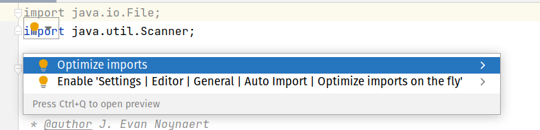

# 02.037 Imports

There are three ways to handle an imported class

* import java.util.Scanner;   //Spell out the class explicitly
* import java.util.*;         //Use * as a wildcard and import all of the files in the library
* java.util.Scanner keyboard = new java.util.Scanner(System.in); //List out the full class name each time a class is used

Most modern IDEs will try to help you out by offering to "Optimize Imports" or a similar task.

