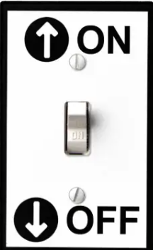
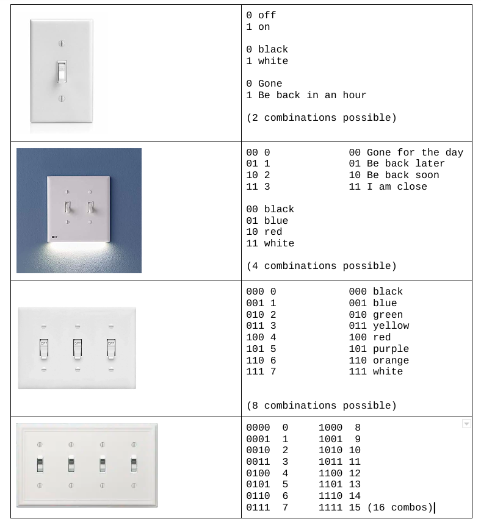

# 03.027 Bits and Bytes

## bit

A ***bit*** is a place to store a 0 or a 1.  The bit is the most fundamental component of computer architecture.
[
&nbsp;|&nbsp;|&nbsp;
:---|:---|:---
 |&nbsp;|1 is on 0 is off
&nbsp;| &nbsp;

bits|possible combinations|&nbsp;
:---:|:---:|---:| 
1| $2^1$ | 2
2| $2^2$ | 4
3| $2^3$ | 8
4| $2^4$ | 16
8| $2^8$ | 256
16| $2^{16}$ | 65,536
32| $2^{32}$ | 4,294,967,296
64| $2^{64}$ | $1.8446744 \times 10^{19}$

# Signed vs Unsigned numbers

If you have 8 bits you may have 256 different values.  For numeric data we have two options

bits|~~Unsigned~~|Signed
:---:|:---:|:---:
8| ~~0 through 255~~|-128 through 127
16| ~~0 through 65,536~~|-32,768 through 32,767
32|~~0 through 4 billion~~|-2 billion through 2 billion

## Byte 

A group of 8 bits is 1 byte on modern computers.