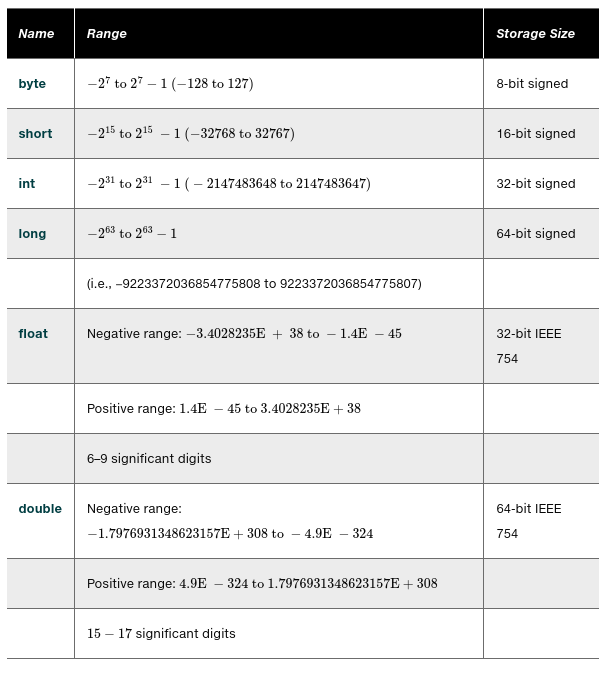

# 03.030 Numeric Data Types




## Numeric Literals

## Floating Point Literals

Numbers with decimal points are assumed to be doubles.

If you want a number to be a float, or to assign it to a float variable, append F to the end of the number

``` java
float small = 1.0F;
```

Technically, the F may be upper or lower case.  However, it is most common to use upper case for literal type designators

### Scientific Notation

1.234 x 10<sup>5</sup> becomes 1.234E5

Scientific notation are doubles.

### Integer literals

Integers may be assigned to a variable as long as they fit.

```java
byte b;
int whole;
long big;
```

* b = 110 //OK
* b = 129 //Not OK
* whole = 2000000000 //OK
* whole = 3000000000 //Not OK
* big = 3000000000L//OK, but the L is needed to indicate "long"

For Long literals, you may technically use lower or upper case L, but avoid lower case because it looks like a 1 in some fonts.

***DO NOT START INTEGERS WITH A ZERO***

Literals are assumed to be digital (base 10)

* Literals starting with 0 are interpreted as octal (Base 8)
* Literals starting with 0B are interpreted as binary (base 2)
* Literals starting with 0X are interpreted as hex (base 16)

What is output by the following?

```java
System.out.println(0B10);
System.out.println(0B101);
System.out.println(0B1111);
System.out.println(0B01000001);
System.out.println(07);
System.out.println(010);
System.out.println(077);
System.out.println(0X10);
System.out.println(0xFF);
```
## Type Conversions and Promotions

The key is that java does not allow losing significant digits by default.  Java requires use of "casts" when precision will be lost.

Java allows "promotion."  So it is OK to assign a float to a double.

### Cast Operator

The cast operator is a datatype in parenthesis

```java
float little = 7.0F
double big;

big = little; //This works
little = big //This is an error
little = (float)big;  // The cast is required
```
