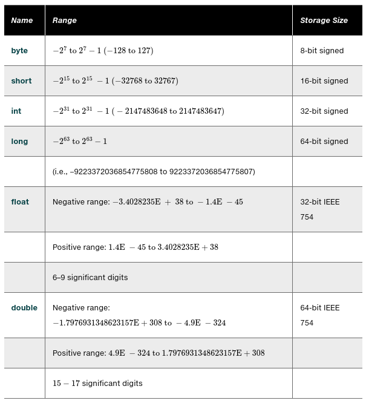

# 03.040 Numeric Types, Operations, and Literals

## Integer data types and literals

See also, table on page 45 of the textbook

## Java Vs C, C++

Java data types are always defined the same way.

* An "int" in Java is always 32 bits
* An "int" in C and C++ is generally defined by the word size of the computer system.  So int could be 8, 16, 32, or 64 bits