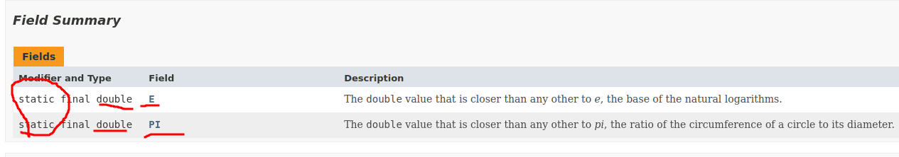

# 07.010 The Math API

[https://docs.oracle.com/en/java/javase/17/docs/api/java.base/java/lang/Math.html](https://docs.oracle.com/en/java/javase/17/docs/api/java.base/java/lang/Math.html)

The Java API is extremely important.  The above link is to the documentation for the Math class.  Note that it is capitalized.  This indicates that it is a class.

## Fields Summary

The Field Summary shows that the Math class has two fields.  These are final doubles, which means they are constants.  Note that they are capitalized because they are constants.  PI is the familiar 3.14159... value.  E is "[Euler's Number](https://en.wikipedia.org/wiki/E_(mathematical_constant))" and has a value of approximately 2.71828.

The "static" is important.  It means that we can access the defined constants by putting "Math." in front of the field names.  So they could be printed by accessing `Math.PI` and `Math.E`.  Note that there is no (parenthesis) because these are not functions; they are constants.

## Method Summary

Next we have the Method Summary.  Other languages would call these functions.  But in Computer Science terminology, a "method" is a function that is part of a class.  In Java, all classes are in classes, so all functions are methods.

Notice that all of the methods are static.  That is unusual.  But it means that all methods may be called by attaching "Math." before the method name.

So the method that returns the square root is `Math.sqrt()`.  You could get the square root of 6 by printing Math.sqrt(6.)

Note that most of the methods return doubles.  There are a few that return other types.  

## Don't Panic

Don't panic.  I am only going to expect you to remember a couple of those methods.  But you should be able to look up the methods if needed.  This includes knowing the meaning of the term "static." 