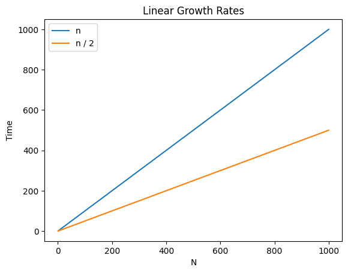

# 12.010 Growth Rates

## Growth Rates

We are now doing loops.  Loops can slow down our programs.  The amount of potential growth rates for
an algorithm is measured in "Big O Notation."  The symbol is $\mathcal{O}$  The 0 symbol is followed by some mathmatical expression in terms of n.

### Only large value of `n` matter.

Big O notation is an *estimate* of how long it will take to execute a loop as the value of n becomes large.  If n is small then the time needed to execute the loop is likely to be trivial and we don't care about it.

In general, Big O notation is about the shape of the curve.  There are certain forms many algorithms fall into.  Some of them have names.

This is a partial list from slowest to fastest at large values of n.

Big O|Name|Subjective Label|Example
:---:|:---:|:---|:---
$\mathcal{O} 1$|Constant|ideal|Calculate a formula (no looping)
$\mathcal{O} log_2(n)$<br> $\mathcal{O}log_\mathcal{e}(n)$ <br>$\mathcal{O}log_{10}(n)$ |Logarithmic|great|Binary Search
$\mathcal{O}n$|Linear|OK in most cases|Linear Search
$\mathcal{O}n\cdot log(n)$|N log N|Acceptable in most cases|QSort
$\mathcal{O}n^2$|N Squared|Bad, often unacceptable|Simple Bubble, Selection, and Insertion sorts
$\mathcal{O}n!$|Factorial|Very, very bad.  Rarely acceptable|Traveling Salesman problem
$\mathcal{O}2^n$ <br> $\mathcal{O}\mathcal{e}^n$ <br> $\mathcal{O}n^n$|Exponential|I hope `n` is less than 10|Brute force password breaking
NP Complete|NP Complete|No known solution in finite time|Optimally filling boxes


## Linear Growth rates

```java
        //This code sums integers from 1 up through n.
        //For example, if n=5, then the program calculates 1+2+3+4+5 for a value of 15.

        int sum = 0;
        int n;
        Scanner input = new Scanner(System.in);

        System.out.print("What is n? ");
        n = input.nextInt();


        //Calculate the theoretical sum
        int theoreticalAnswer = (n*n + n)/2;
        System.out.printf("The theoretical sum of 1 though %,d is %,d\n", n, theoreticalAnswer);

        //Calculate the sum by brute force
        sum = 0;
        for(int i = 1; i<=n; i++){
            sum += i;
        }
        System.out.printf("The calculated sum of 1 though %,d is %,d\n", n, sum);
```

The above code represents two different growth rates.

### $\mathcal{O} 1$ Constant Growth Rate

The theoretic value is calculated by using the formula `(n*n + n)/2`

This is an example of $\mathcal{O}1$ or *Constant* growth rate.  It does not matter how large the value of `n` is.  

### $\mathcal{O} n$ Linear Growth Rate

The brute force method uses a loop.  The body of the loop will execute n times.  This means the growth rate is $\mathcal{O}n.  As n gets large the number of passes through the inner part of the loop will increase proportionately.  In other words, the time it takes to execute will continue proportionately.

Here is another example of a linear growth rate.

```java
String line = input.nextLine();
String[] parts = line.split(" ");
int n = parts.length;
int i = 0;
boolean found = false;
while( !found && i<n ){
    found = (parts[i].equalsIgnoreCase("stop");)
    i++;
}
```
In the above block of code, the loop may execute up to 10 times.  But it may go through the loop fewer times because the word "stop" may be early in the list of words, or it may be at the end (or not appear at all).  If we assume that the user input usually includes "stop" then it is fair to say that sometimes the loop will stop early and sometimes it will be late.  On average, the loop will probably execute about half-way through the loop.

So in this searching loop, it could be argued that the loop will execute approximately n/2 times.  This is fewer and better than n.  But in terms of "Big O" notation, both of these are considered to be "Linear" with a growth rate of $\mathcal(O) n$.  

* With growth rates we are concerned with the ***shape of the curve***.  In both of these cases the time graphs to a straight line.  Therefore both lines have the same shape.  They are linear.
* When calculating growth rates we normally ignore constants.  We use the factor that has the greatest impact on the time.



