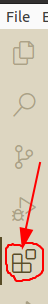
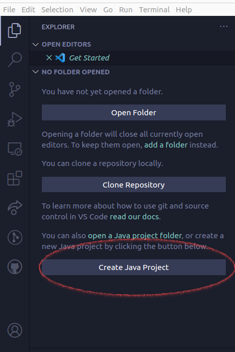
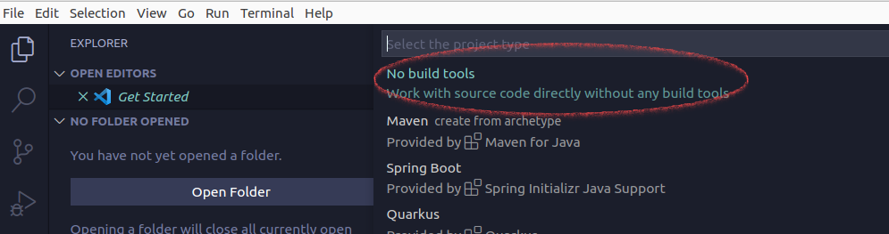
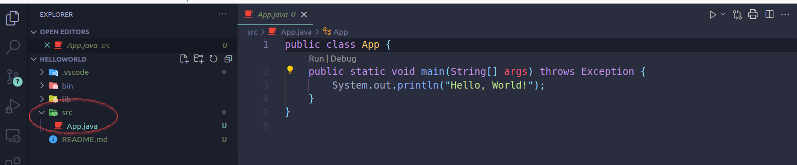
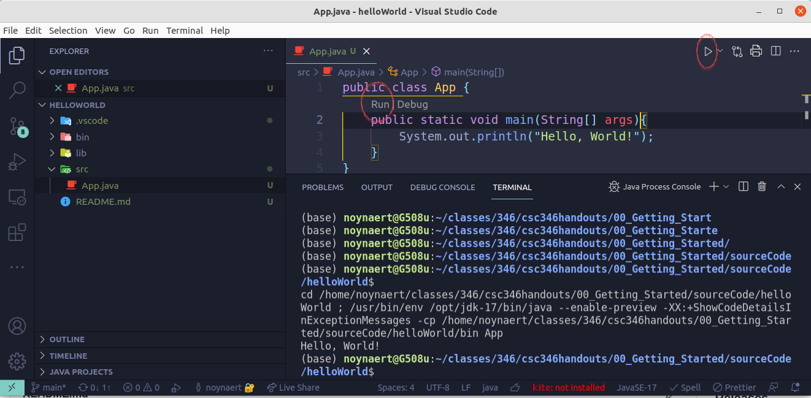

# 00.025 Installing VS Code

IDE stands for "Integrated Development Environment.  Most IDEs include the following components

* A text editor that is customized for editing code
* A mechanism for compiling and running code
* Debugging

There are a lot of options for an IDE.

* VS Code -- This is what I will use, at least at the start of the course.  VS Code and Java did not mix at first, but it has gotten much better.
* Intellij -- This may be the best Java IDE available.  There is a free Community Edition and a Pro Version that is rather expensive.  The Community Edition does lack features we will need in this course.  The good news is that you may get free access to the Pro Edition if you register your @missouriwestern.edu email address
* Eclipse -- This is an old but good IDE. In my experience the biggest problem with Eclipse in a classroom environment is that Eclipse is highly customizable.  Everyone's installed version seems to work differently than everyone else in the class.
* Netbeans -- We used to use Netbeans.  However, it seems to have fallen behind the other major IDEs.  But it may work.

## VS Code

Code is a free program from Microsoft.  It is also called "VS Code" or just "code"

Download and install VS Code from [https://code.visualstudio.com/download](https://code.visualstudio.com/download)

I will let you handle the install on your own.

## Video Studio Code

Some people will have used VS Code in ACT 102 or some other situation.  There are a number of good VS Code tutorials on YouTube.  

### Optional overview of VS Code

Here is one tutorial. The good stuff starts at 1:37, and this link takes you there.[https://youtu.be/ORrELERGIHs?t=97](https://youtu.be/ORrELERGIHs?t=97)  Don't install the extensions shown in the video, at least not yet.  Don't worry about remembering everything in the video.  We will hit these topics later in the course.

## Adding extensions

Open VS Code and add the extensions we need for this course.  Begin by clicking on the Extension tab on the left margin.

 

 Add the following extensions.  Search for the name, but check for the author as well.  It is important to check the author because several extensions may have the same name.

 ### Required extension

 * Extension Pack for Java by Microsoft

This is actually a bundle of several different extensions related to Java.  It is a fairly slow download.

### Recommended extension

I have found the following extensions useful:

* Prettier Code formatter by Prettier
* PrintCode by nobuhito
* Code Spell Checker by Street Side Software
* Ctrl-Semicolon by Gforcedev
* Live Share by Microsoft

## A test Java Program

The major thing to realize is that VS Code works in terms of directors or folders.  Do not think of it as a "file editor."  It is a "Project editor."  *Each Java project should be in its own directory or folder.*

I suggest that you set up a directory for this course which will hold all of the programs in the course.  Each program will be a project that appears in its own sub-directory.

### Step 1:  Make the project

Open VS Code.  ***Close any folders that are open***.  Make sure the "File" flyout window is open.  You should see the bottom option is to Create a new Java Project.  

Alternately, you may hit the F1 or Ctrl-Shift-P to pen the pmopt and search for "Java:Create Java Project"

#### No Build tools

A prompt will appear.  Later we will use Maven, but initially select "No Build Tools."

I feel like "No Build Tools" is a lie.  We are actually selecting a minimalist set of build tools.

#### Watch out!  

Next, select the folder where you project will be created.  For most students, this will be a folder like CSC346/Projects

You are only selecting the folder that will hold your project

### Project Name

You need to pick a project name.  
  
    * No blanks in the file name!

### Find your source code

The Source code is in the src folder.  By default there is a program named App.java.  You may rename the file, but if you do you must also rename the class.  Java does handle refactoring.  But for most programs in this course the App.java name will work.  For the assignments it is preferred to simplify grading

### Remove the "throws Exception" modifier on the class

By default the App.java adds "throws Exception."  This is bad practice in most cases, so remove it.

##  Build and run the program

There are a number of different ways to run the program.  For now you will probably either want to select the "Run" in the "Run/Debug" option in Main, or you will want to hit the run arrow.  Debugging is also an option.

