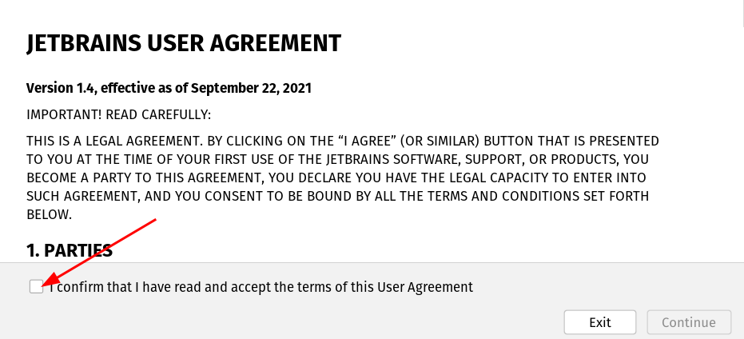
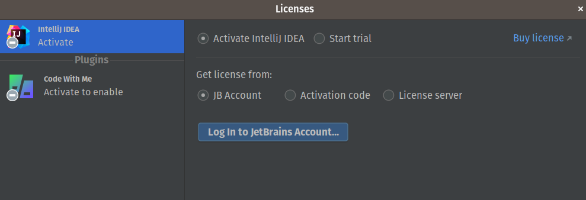
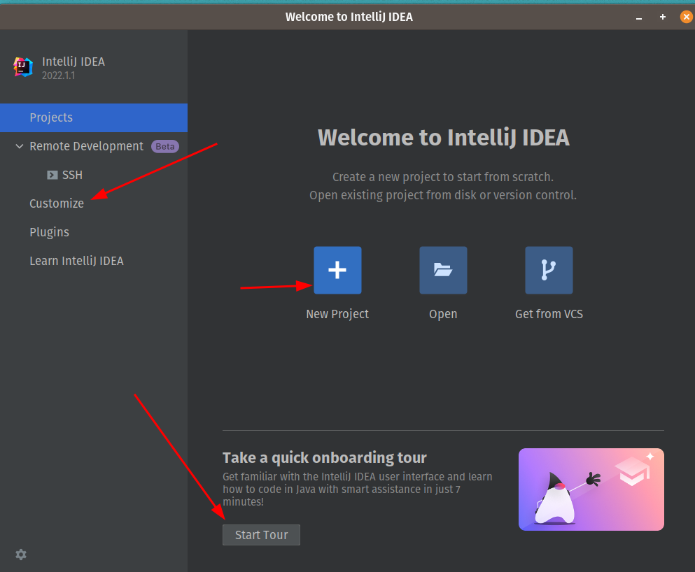

# 01.030 Installing Intellij Idea

IDE stands for "Integrated Development Environment.  Most IDEs include the following components

* A text editor that is customized for editing code
* A mechanism for compiling and running code
* Debugging

There are a lot of options for an IDE.

* VS Code -- VS Code is a fantastic general-purpose editor.  Microsoft, RedHat, and others have done a good job of trying to bring Java to VS Code.  But as of the time this is being written (Summer, 2022) VS Code is not quite up to the level we need for CSC 254.  It is definitely insufficient for more advanced courses like CSC 346.
* Intellij -- This may be the best Java IDE available.  There is a free Community Edition and a Pro Version that is rather expensive.  The Community Edition does lack features we will need in this course.  The good news is that you may get free access to the Pro Edition if you register your @missouriwestern.edu email address.  An additional benefit of Intellij is that it is the software used for Android Studio.  So if you wish to do any Android programming everything will be familiar.
* Eclipse -- This is an old but good IDE. In my experience the biggest problem with Eclipse in a classroom environment is that Eclipse is highly customizable.  Everyone's installed version seems to work differently than everyone else in the class. This wastes a lot of class time as we try to figure out how to do some things in the version of Eclipse you are using.  It also makes watching videos frustrating because the version of Eclipse used in the videos is almost always differnt than the version the students are using.
* Netbeans -- We used to use Netbeans.  However, it seems to have fallen behind the other major IDEs.  But it may work.

## Intellij

### Editions of Intellij

First of all, the name is formally `IntelliJ IDEA.` Your operating system might feature the name IntelliJ, but other installs may feature the name IDEA.  

* **Community Edition** The big advantage of the Community Edition is that it is free.  However, it is limited in some important ways.
* **Ultimate Edition** The big disadvantage of the ultimate edition is that it is expensive.  But, fear not, students and faculty can get the student edition for free.  

### Getting the Ultimate Edition as a student

I think the easiest way to get the student edition is to create a student account *before* you download Intellij.  Having the student account approved and in-hand makes installing and registerin Intellij a little easier.

To register a student account, go to [https://www.jetbrains.com/community/education/#students](https://www.jetbrains.com/community/education/#students).  As of the time I am writing this, there is a big blue "Apply Now" button on the page. 

### Download and install

The Download and Install procedures are somewhat different for Windows, Linux, and Macs.  I will assume that as Computer Science majors you can handle it.  I do suggest that you wait until you have your JetBrains account set up and the student status approved before you do the download and install.  However, if you don't want to wait you should be able to start out with the ultimate edition and register it later.

After you install IDEA the first time you will need to Agree to the terms.  This is a bit tricky.  Obviously you need to check the checkbox.  What is not obvious is that you have to scroll all the way to the bottom of the agreement before you can continue.

After you have scrolled to the bottom, clicked the agreement box and clicked the "Continue button you are asked to activate your license.  This should be easy if you have set up your JetBrains account.  If you have not set up your account you should be able to start a 30-day trial while your account.  You can use that grace period to activate the account.

The JetBrains startup screen has three arrows that may be of interest.

There are three things that may be of interest to you on this page.  

* Customize the file settings.  By default Jetbrains stores projects in a folder called "IdeaProjects" in your home directory.  This will work for now, but when you take your next Java course it may become confusing to have different courses mexed togehter.  If you wish, you may go to Customize/All Settings/SystemSettings and change the "Default Project Directory" to some other directory or folder.
* You can start a new project.  You will be using this item a lot.
* There is a "Start Tour."  I don't suggest you use it  right now.  I do suggest that you try it after you get a couple of programs finished.  I think it will make more sense at that point.

## A test Java Program

The major thing to realize is that VS Code works in terms of directors or folders.  Do not think of an IDE as a "file editor."  It is a "Project editor."  *Each Java project should be in its own directory or folder.*

I suggest that you set up a directory for this course which will hold all of the programs in the course.  Each program will be a project that appears in its own sub-directory.

### The 

### Step 1:  Make the project

Open VS Code.  ***Close any folders that are open***.  Make sure the "File" flyout window is open.  You should see the bottom option is to Create a new Java Project.  

Alternately, you may hit the F1 or Ctrl-Shift-P to pen the pmopt and search for "Java:Create Java Project"

#### No Build tools

A prompt will appear.  Later we will use Maven, but initially select "No Build Tools."

I feel like "No Build Tools" is a lie.  We are actually selecting a minimalist set of build tools.

#### Watch out!  

Next, select the folder where you project will be created.  For most students, this will be a folder like CSC346/Projects

You are only selecting the folder that will hold your project

### Project Name

You need to pick a project name.  
  
    * No blanks in the file name!

### Find your source code

The Source code is in the src folder.  By default there is a program named App.java.  You may rename the file, but if you do you must also rename the class.  Java does handle refactoring.  But for most programs in this course the App.java name will work.  For the assignments it is preferred to simplify grading

### Remove the "throws Exception" modifier on the class

By default the App.java adds "throws Exception."  This is bad practice in most cases, so remove it.

##  Build and run the program

There are a number of different ways to run the program.  For now you will probably either want to select the "Run" in the "Run/Debug" option in Main, or you will want to hit the run arrow.  Debugging is also an option.

