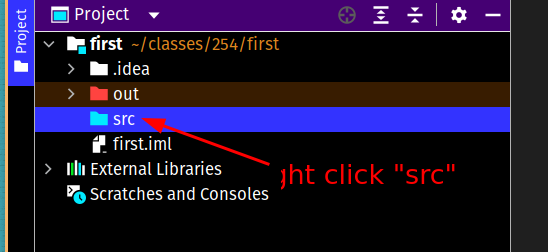
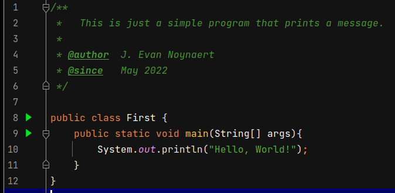
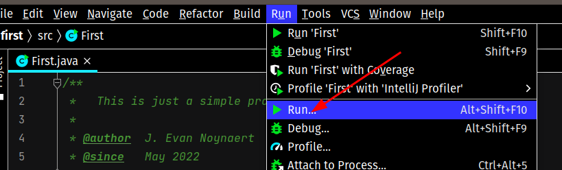

# 01.040 First Program

## Some things to understand first:

### Think in terms of proojects, not files

It is technically possible to work with individual files in Java, but that is rarely done in practice.

Java projects work in terms of directories.  Certain directory structures are actually built into the syntax of Java.

Intellij will automatically set up a fairly complicated set of directories when you start a Java project.  For now, accept the structure.  The purpose of the structure should be come more clear as you move ahead into your knowledge of Java.

### Java classes and file names

Almost everything in Java must be inside a class.  By convention class names have the first letter capitalized.  For now we will only be working with `public` classes.

Public classes must be in a file that has the same name as the class.

There are rules for class names.  Because the file name must match the class.  Therefore the class must match the rules for a class.

* No blanks.  Blanks in file or directory names are :imp: evil :imp:.
* Must start with a letter (upper case)
* Following characters must be letters, digits, or underscores

## Steps for setting up and running a problem

1. Start Intellij if it is not already started.
2. Select "New Project"  This may show up in different places depending on whether you have an existing project open.
3. Put in the name of your project. It shouldn't have a blank in the name.  It should be meaningful.  Capitalization doesn't really matter.  I just used "firstProgram" as the project name.
4. Over on the left side, look for the "src" folder. Right click on it. 
5. Select "New" and "Class."
6. Type the name of the new class as `First` Be sure to make the first letter upper case.
   * Intellij should create a pbulic class named first.
   * The file name it created is named First.java
7. Type the following program. 
   * Note that the comment starts with /**  because it is a "javadoc style" comment.
   * Be careful with capitalization.  
   * Watch out for semicolons **;** and **{** curly braces **}** 
8. For the first run you will need to use the Run menu and then pick Run. 
    * After the first run you will see that there is now a "First" run configuration on the upper right.  
9. Get in the habit of right clicking on your code and reformatting it to make sure it is indented correctly.
    * The syntax of Java does not require a particular indentation like Python
    * The indentation is still considered important for readability.
    * The general Python rules for indentation are still good ones to follow.
    * In particular look at the way the curly braces are laid out.