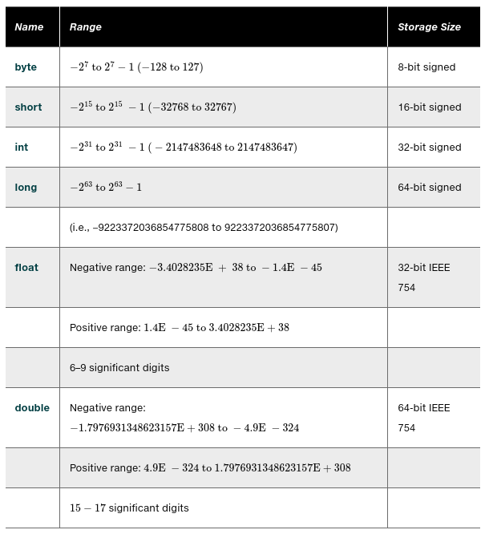

# 02.080 Numeric Data Types and Operations

# Arithmetic Operators

Operator|Meaning
:---:|:---
+|Addition
-|Subtraction
*|Multiplication
/|Division
%|Modulo

***Be careful with Integer Division***




## Reading Numbers from the keyboard

[https://docs.oracle.com/en/java/javase/11/docs/api/java.base/java/util/Scanner.html](https://docs.oracle.com/en/java/javase/11/docs/api/java.base/java/util/Scanner.html)


```java
//Illustrates reading from keyboard

import java.util.Scanner;

public class ReadKeyboard{
    public static void main(String[] args){
        int whole;
        double x;
        Scanner keyboard = new Scanner(System.in);

        System.out.print("Enter an integer: ");
        whole = keyboard.nextInt();
        System.out.println("Whole number is " + whole);

        System.out.print("Enter a double: ");
        x = keyboard.nextDouble();
        System.out.println("Double is "+double);

    }
}
```

## Exponentiation

Use the Power function for exponentiation

*  2<sup>3</sup> is coded as `Math.pow(2,3)`
* -3.2<sup>-0.5</sup> $ is coded as `Math.pow(-3.2,-0.5)`

## Numeric Literals

## Floating Point Literals

Numbers with decimal points are assumed to be doubles.

If you want a number to be a float, or to assign it to a float variable, append F to the end of the number

``` java
float small = 1.0F;
```

### Scientific Notation

1.234 x 10<sup>5</sup> becomes 1.234E5

### Integer literals

Integers may be assigned to a variable as long as they fit.

byte b;
int whole;
long big;

* b = 110 //OK
* b = 129 //Not OK
* whole = 2000000000 //OK
* whole = 3000000000 //Not OK
* big = 3000000000L//OK, but the L is needed to indicate "long"

For Long literals, you may technically use lower or upper case L, but avoid lower case because it looks like a 1 in some fonts.

***DO NOT START INTEGERS WITH A ZERO***

Literals are assumed to be digital (base 10)

* Literals starting with 0 are interpreted as octal (Base 8)
* Literals starting with 0B are interpreted as binary (base 2)
* Literals starting with 0X are interpreted as hex (base 16)

What is output by the following?

```java
System.out.println(0B10);
System.out.println(0B101);
System.out.println(0B1111);
System.out.println(0B01000001);
System.out.println(07);
System.out.println(010);
System.out.println(077);
System.out.println(0X10);
System.out.println(0xFF);
```
## Type Conversions and Promotions


    
